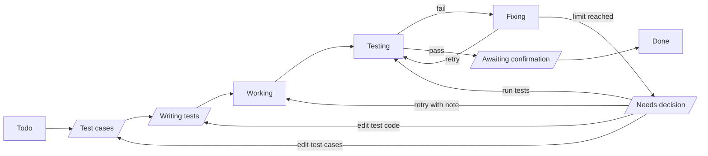
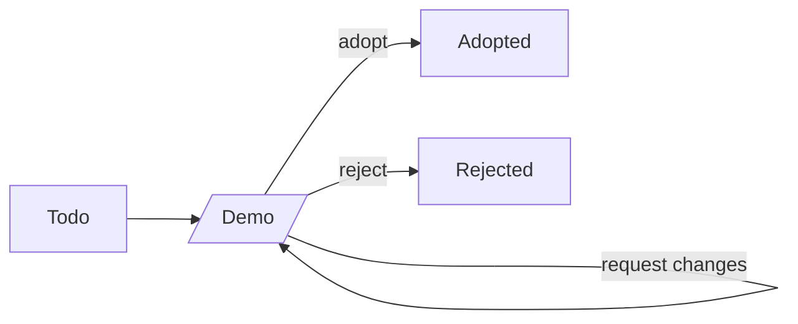
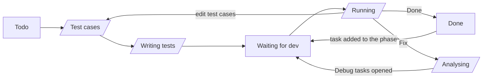

# Tickie: Product and Technical Decisions

Sep 26, 2026 · @Josh Tsai

## Overview

A fully local Mac desktop app for opening tickets and dispatching work to AI coding agents on my machine from a PM's (Project Manager's) point of view, with every task gated by locked test cases. The name is Tickie: a ticket is only done once every item on its acceptance checklist has been ticked.

**Goals**: stop getting lost halfway through my own side projects, and have a full-stack project I can talk about in job interviews in Sydney.

**Key difference**: existing tools put the diff at the center of review. This tool puts the **test cases** at the center; I only look at the code when I need to.

| Existing category | Examples | Has | Missing |
| --- | --- | --- | --- |
| AI agent kanban boards | [Vibe Kanban](https://github.com/BloopAI/vibe-kanban), Cline Kanban, AgentsRoom | Opening tickets, dispatching to local agents | Built around diffs and PRs; no schedule |
| Spec-driven development | [Kiro](https://kiro.dev/docs/specs/), GitHub Spec Kit | Phases, tasks, acceptance criteria | An IDE (Integrated Development Environment), not a visual PM interface |
| Local PM tools | [WayPoint](https://github.com/DonaldTrump-coder/WayPoint) | Local, kanban + Gantt chart | Doesn't dispatch work to coding agents |

Where this project sits = dispatching from the first category + acceptance gating from the second + a visual schedule from the third.

## Product rules

I finalize everything. Agents produce first drafts and do the work, and hand things back to me only when something goes wrong.

### Screens

1. The home page shows **all** projects, in my own order (drag to reorder). Each shows only its description and its current phase and task.
   - **Current phase** shows how far the project has got: the last phase in which any task has moved past Todo, or the next phase once that one's QA is Done. Reopening an earlier phase (adding a task after its QA was Done) does not move it back.
   - **Current task** is the first unfinished task of the current phase in time order (earliest planned start, ties broken by task order). If the current phase has nothing unfinished, it falls back to the earliest unfinished task in any phase.
   - **+** adds a project in one of two ways; new projects go to the top:
     - **Open existing folder**: pick a folder already on my Mac. If it belonged to a removed project, that project comes back instead.
     - **New empty folder**: enter a name and description, and pick where the folder goes each time; Tickie creates the folder.
   - Folders are always picked with a folder dialog, never by typing a path.
   - **×** removes a project from the home page after a confirmation. It's a soft removal: nothing under it is deleted. Adding its folder again brings it back with all its phases, tasks and history.
2. Opening a project shows its phases in order, numbered (Phase 1, 2, 3…), with the current phase marked. There is no priority ordering.
   - Under each phase are its tasks in time order (earliest planned start first). Each shows an icon for its type (Build, Debug, Design, QA) and a colored status.
   - Tasks in progress (past Todo but not finished) are highlighted. Finished tasks (Done, Cancelled, Adopted, Rejected) are folded away under each phase, and a phase whose tasks are all still Todo is folded too, except the current phase.
   - Every phase, including a finished one, has a **+** to open a task by hand (Build, Design or Debug; see rule 6).
   - A floating chat button in the corner opens a chat with the planning agent or the IT supervisor agent (see rule 5 and "Chat session").
3. I **manage** one project at a time, but agents from several projects can **run** in the background at the same time.
4. A task that has an agent running on it shows a small animation or indicator light, so I can tell at a glance whether the agent is working or the task is waiting on me.

### Flow and roles

5. The planning agent discusses direction with me in chat → I approve → it produces a brief or agents.md. Planning work does **not** get tasks.
   - The **IT supervisor agent** is for mid-project trouble: when a bug or a hard problem comes up, I talk it through with it in chat and it works out how to handle it (for example, a replacement task). It only **proposes**: nothing changes until I approve, just like planning. Like planning, this happens in chat and doesn't get tasks. It also handles QA's Analysing step and can be called in from Needs decision.
6. Tasks are units of work for agents. There are four task types: **Design**, **Build**, **Debug** and **QA** (Quality Assurance). I can open Design, Build and Debug tasks myself; QA tasks are never opened by hand (see below).
7. A Design task has the design agent build a demo; I decide whether to adopt it. Adopting it opens the Build tasks that implement it, with the Design task as their prerequisite.
8. Test cases for Build, Debug and QA tasks: AI writes a first draft in plain language → I review, add and remove → they're locked. A separate **test agent** then turns them into test code → I review → it's locked. The coding agent can read both but change neither; I can always change them.
9. When coding fails **3 times** in a row, it stops. The agent attaches its assessment without categorizing it; the final call is always mine.
10. When opening a task, list its prerequisite tasks (there can be several). Until they're done or cancelled, the task can't start and its tests can't be written. Tasks with no dependency between them can run in parallel.
11. QA E2E (End-to-End) tests run at the end of each phase, not once per task. Each phase has exactly **one** QA task, created by the planning agent as part of the plan.
12. Whether QA passes or fails, I make the call. Choosing Fix has the IT supervisor agent trace the problem and propose **Debug tasks** (with draft test cases attached), which follow exactly the same flow as Build tasks.

### Schedule

13. The planning agent estimates each task's planned start time and estimated hours, and I approve them together with the rest of the plan.
14. Estimated hours **include time spent waiting on me**, because that's a cost too.
15. The baseline is saved once at approval and never changes. Tasks added later (including Debug tasks) are marked "unplanned".

### Background execution

16. Closing the window leaves the agents running. Closing the laptop lid pauses them; when it's reopened they resume **automatically** from the latest git commit checkpoint and leave an entry on the task.

## Task status flows

Status names describe the **stage** a task is in, not whose turn it is. Some stages start with an agent working and end with the task waiting on me (slanted boxes below).

**Whose turn it is is derived, not stored**: if no agent is running on the task and it's not in a status that waits on other tasks (Todo, Waiting for dev) or a finished status (Done, Cancelled, Adopted, Rejected), it's waiting on me. The "pending list" is simply every task in that situation.

Resuming automatically after a disconnect is **not** a status; it only leaves an entry in the status history.

### Build and Debug tasks

- **Test cases**: AI drafts the plain-language test cases, then I review and lock them.
- **Writing tests**: the test agent writes the test code, then I review and lock it.
- **Fixing**: the coding agent retries and fixes things on its own without bothering me.
- **Needs decision**: it failed up to the limit in a row; the agent attaches its assessment and stops. I choose one of:
  - **Edit test cases** → Test cases: the acceptance criteria themselves are wrong.
  - **Edit test code** → Writing tests: the criteria are fine, but the test agent translated them into code wrongly.
  - **Retry with note** → Working: the agent is stuck going the wrong way; I tell it what to try.
  - **Run tests** → Testing: I fixed the code myself. If the tests still fail, the normal flow continues into Fixing, and the agent may change the code I edited (it still can't touch the tests).
  - **Ask IT supervisor**: talk it through in chat; it proposes one of the choices above (or new tasks), and nothing happens until I approve.
  - **Cancel task** (see below).
- The consecutive-failure count **resets to zero** after any of these decisions.
- **Cancelled**: I can cancel a Build or Debug task at any point before it's Done. Any agent running on it stops immediately. Cancelled is an end state, and it **counts as finished** for dependencies and for QA's Waiting for dev: tasks that depended on it simply go ahead. If one of them then fails because the cancelled work is missing, I (or the IT supervisor agent) open a new task to replace it.
- Design tasks can't be cancelled (Rejected covers that), and neither can QA tasks (a phase can't end without its one QA task).

### Design tasks

- **Demo**: the design agent builds the demo, then I choose adopt, reject or request changes.
- Adopted and Rejected are separate end states, because a rejected design is still a meaningful outcome when looking back at the schedule.

### QA tasks

- **Todo → Test cases** happens automatically when the phase starts, so the E2E test cases are written and reviewed while Build tasks are still in progress.
- **Waiting for dev**: once the tests are locked, the QA task waits here as long as any other task in the phase (Design, Build or Debug) hasn't finished. Cancelled, Adopted and Rejected count as finished. When the last one finishes, the QA task moves to Running automatically.
- **Running**: the QA agent runs the E2E tests. Whether they all pass or not, it stops and I choose:
  - All passed: **Done** (the phase ends and the next phase begins) or **edit test cases**.
  - Something failed: **Fix** or **edit test cases**.
  - I can also choose Fix when everything passed, e.g. when I found a problem by hand. Fix takes an optional note describing what I saw.
- **Analysing**: the IT supervisor agent traces the problem and proposes Debug tasks. Once I approve them they're opened, which sends the QA task back to Waiting for dev. If it finds no cause and proposes **no** tasks, it stops and shows me its analysis instead of rerunning the same failing tests.
- **Done → Waiting for dev**: opening any new task in a phase whose QA is Done (a bug or small feature found later) sends the QA task back to Waiting for dev automatically, so the phase is no longer done until the E2E tests pass again. The status history entry notes which task was added.
- Because every loop goes through me, QA can't retry forever on its own and needs no failure limit.
- The original tasks' records stay unchanged.

## Data model

Layer by layer: Project → Phase → Task → Test case / Status history, each one-to-many; separately, Project → Chat session → Chat message. Prerequisites between tasks are many-to-many and get their own dependency table. Principle: **anything that can be derived from system behavior is never entered by hand and never stored separately.**

### Project

| Field | Source |
| --- | --- |
| Name, description | Entered by me |
| Folder path | The project's folder on disk, picked or created when the project is added; this is what identifies a project |
| Baseline frozen at | Recorded automatically when the plan is approved |
| Sort order | Set by me by dragging on the home page |
| Removed at | Set when I remove the project from the home page; cleared when it's restored |
| Current phase and task | Not stored; derived from task statuses and order |

### Phase

| Field | Source |
| --- | --- |
| Name, order | Planned by the planning agent, approved by me |
| Is done | Not stored; true when the phase's QA task is Done |

### Task

| Field | Source |
| --- | --- |
| Title, tagline | Planning agent or me |
| Assigned agent | The AI tool that does the work (e.g. Claude Code, Codex); set when the task is opened |
| Phase, order | Planned by the planning agent, approved by me |
| Planned start, estimated hours | Estimated by the planning agent, approved by me (including time waiting on me) |
| Current status | Updated by the system as the flow progresses |
| Is unplanned | Set automatically on tasks added after approval |
| Task type | Design, Build, Debug or QA |
| Source task | Debug tasks only; points to the task where the problem was found |
| Progress | Not stored; derived from passing tests (e.g. 3/5) |
| Actual start, actual end | Not stored; taken from the status history (first move out of Todo, and reaching an end state) |
| Agent running | Not stored; reported live by the background manager |
| Waiting on me | Not stored; derived from status and whether an agent is running (see "Task status flows") |

### Test case

| Field | Source |
| --- | --- |
| Task, content | First draft by AI, reviewed by me |
| Is locked | Locked when I finalize it |
| Passed on last run | Updated by the system when tests run |

### Status history

One entry per status change: task, from status, to status, time, and an optional note. Interruptions and resumes are recorded here too, as an entry whose from and to status are the same (e.g. Working → Working) with a note saying what happened, such as which commit it resumed from. Design's request changes is recorded the same way (Demo → Demo), and so are my notes on Retry with note and Fix. Used to derive actual time, and later to feed back to the planning agent to calibrate its estimates.

### Agent runs

One entry each time an agent starts or stops working on a task: task, agent, start time, end time. Because status names no longer say whose turn it is, this is what lets the system derive total time spent waiting on me.

### Chat session

One entry per conversation: project, agent (Planning or IT supervisor), start time. I start a new session by hand; older sessions stay readable but aren't sent to the agent.

### Chat message

One entry per message: session, whether I or the agent sent it, text, time.

### Task dependency table

One row per relationship: task ← prerequisite task. The system checks this when a task is opened and doesn't allow circular dependencies (A waits on B, B waits on A).

## Tech stack and architecture

The UI and the background manager are two separate programs that talk through a local API (Application Programming Interface). Closing the window leaves the manager and the agents running.

| Layer | Choice | Why |
| --- | --- | --- |
| Desktop shell | Tauri (Mac build only for now) | Uses less memory than Electron; can bundle the C# manager as a sidecar; a Windows build is possible later |
| UI | Vue 3 + TypeScript | I want to practice it; common at Taiwanese companies; also in demand at .NET agencies in Sydney. TypeScript types for the mock data act as the contract with the future C# API |
| Background manager | C# + ASP.NET Core (Controllers) | Builds on my C# from UTS courses; lots of .NET jobs in Sydney; one framework for both the API and background services |
| Data access | EF Core (Entity Framework Core, an ORM) | Can switch databases; also a common skill in .NET job listings |
| Database | SQLite | A single file built into the manager; no separate server |
| Real-time updates | SignalR | Pushes task changes; reconnects automatically when the laptop wakes up |
| Project output | Project folder + git | The brief, agents.md, tests and code are versioned in git; commits serve as resume checkpoints |

**Distribution**: using it myself costs nothing. Distributing it to others requires Apple signing and notarization through the Apple Developer Program (AUD $149/year); the free alternative is having users build from source. Homebrew stopped supporting unsigned apps on 2026-09-01, so that route isn't viable.

## Open questions and next steps

### Decided

- The whole system uses English: UI text, code, database values and documentation.
- A unit of work is called a **Task** (not a card).
- The status where the coding agent retries on its own is **Fixing** (renamed from Debugging to avoid clashing with the Debug task type).
- The consecutive-failure limit is **3**.
- New tasks can be opened in any phase, including one whose QA is already Done: bugs or small features are often found after a phase ends. Doing so sends that phase's QA back to Waiting for dev.
- Chat with the planning agent and the IT supervisor agent is split into **sessions**. Every message is stored and can be read back, but an agent only receives the current session plus the project's current state (brief, agents.md, tasks and statuses), never older sessions. This keeps token use flat; anything worth keeping must be approved into the brief or the tasks anyway.
- Planning, design and QA roles: planning happens in chat with no tasks; design and QA get their own task types and flows (see "Task status flows").

### Still open

- Whether removing a project should stop agents still running on it.
- Whether "Needs decision" and the other status names above are final.
- What to name the Task class in C# code: `Task` clashes with C#'s built-in `System.Threading.Tasks.Task` (decide when writing the backend).
- Who drafts the Build tasks when a Design task is adopted (the planning agent, the design agent, or me).
- Whether to show a macOS notification when a task enters a status that waits on me.
- Details of the Gantt chart view.

### Next steps

- [ ] Build a demo with Vue 3 and mock data, starting with the home page and the project page. The mock data follows the "Data model" section and will later become the API response format.
- [ ] The demo is finished when a task can be clicked through its whole flow from Todo to Done. Stop there instead of polishing the screens.
- [ ] Start writing the C# manager by hand, step by step, and connect it to real agents.
