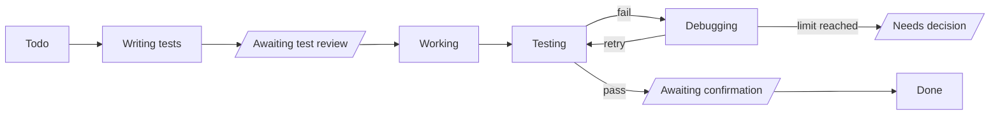

# Tickie: Product and Technical Decisions

Sep 26, 2026 · @Josh Tsai

## Overview

A fully local Mac desktop app for opening tickets and dispatching work to AI coding agents on my machine from a PM's (Project Manager's) point of view, with every card gated by locked test cases. The name is Tickie: a ticket is only done once every item on its acceptance checklist has been ticked.

**Goals**: stop getting lost halfway through my own side projects, and have a full-stack project I can talk about in job interviews in Sydney.

**Key difference**: existing tools put the diff at the center of review. This tool puts the **test cases** at the center; I only look at the code when I need to.

| Existing category | Examples | Has | Missing |
| --- | --- | --- | --- |
| AI agent kanban boards | [Vibe Kanban](https://github.com/BloopAI/vibe-kanban), Cline Kanban, AgentsRoom | Opening tickets, dispatching to local agents | Built around diffs and PRs; no schedule |
| Spec-driven development | [Kiro](https://kiro.dev/docs/specs/), GitHub Spec Kit | Phases, tasks, acceptance criteria | An IDE (Integrated Development Environment), not a visual PM interface |
| Local PM tools | [WayPoint](https://github.com/DonaldTrump-coder/WayPoint) | Local, kanban + Gantt chart | Doesn't dispatch work to coding agents |

Where this project sits = dispatching from the first category + acceptance gating from the second + a visual schedule from the third.

## Product rules

I finalize everything. Agents produce first drafts and do the work, and hand things back to me only when something goes wrong.

### Screens

1. The home page shows the five most recent projects. Each shows only its description and its current phase and task (the first unfinished card in planned order).
2. Opening a project shows all of its pending items, sorted by time. There is no priority ordering.
3. I **manage** one project at a time, but agents from several projects can **run** in the background at the same time.

### Flow and roles

4. The planning agent discusses direction with me → I approve → it produces a brief or agents.md.
5. The design agent builds a demo → I approve → it's finalized and handed to the coding agent.
6. AI writes the first draft of the test cases → I review, add and remove → they're finalized and locked. The coding agent can read them but not change them; I can always change them.
7. When coding fails a set number of times in a row, it stops. The agent attaches its assessment without categorizing it; the final call is always mine.
8. When opening a card, list its prerequisite cards (there can be several). Until they're done, the card can't start and its tests can't be written. Cards with no dependency between them can run in parallel.
9. QA (Quality Assurance) E2E (End-to-End) tests run at the end of each phase, not once per card.
10. QA finds a bug → the agent traces its source and opens a new **debug card** with draft test cases attached, which then follows the normal flow.

### Schedule

11. The planning agent estimates each card's planned start time and estimated hours, and I approve them together with the rest of the plan.
12. Estimated hours **include time spent waiting on me**, because that's a cost too.
13. The baseline is saved once at approval and never changes. Cards added later (including debug cards) are marked "unplanned".

### Background execution

14. Closing the window leaves the agents running. Closing the laptop lid pauses them; when it's reopened they resume **automatically** from the latest git commit checkpoint and leave an entry on the card.

## Card status flow

A card passes through three points where it stops and waits for me on its way from Todo to Done. The "pending list" is simply every card sitting in one of those statuses; it isn't stored separately.

(Slanted boxes = statuses that stop and wait for me)

- **Debugging**: the agent retries and fixes things on its own without bothering me.
- **Needs decision**: it failed up to the limit in a row; the agent attaches its assessment and stops.
- Resuming automatically after a disconnect is **not** a status; it only leaves an entry in the status history.

### QA at the end of a phase

Once every card in a phase is done, the QA agent runs the E2E tests. If they fail, the agent traces the source and opens a new debug card (marked unplanned, with draft test cases), which goes through the same flow as above. QA reruns after the debug card is done. The original card's record stays unchanged.

## Data model

Layer by layer: Project → Phase → Card → Test case / Status history, each one-to-many. Prerequisites between cards are many-to-many and get their own dependency table. Principle: **anything that can be derived from system behavior is never entered by hand and never stored separately.**

### Project

| Field | Source |
| --- | --- |
| Name, description | Entered by me |
| Baseline frozen at | Recorded automatically when the plan is approved |
| Current phase and task | Not stored; derived from card statuses and order |

### Phase

| Field | Source |
| --- | --- |
| Name, order | Planned by the planning agent, approved by me |
| Is done | Not stored; true when every card under it is done |

### Card (Task)

| Field | Source |
| --- | --- |
| Title, tagline | Planning agent or me |
| Assigned agent | Set when the card is opened |
| Phase, order | Planned by the planning agent, approved by me |
| Planned start, estimated hours | Estimated by the planning agent, approved by me (including time waiting on me) |
| Current status | Updated by the system as the flow progresses |
| Is unplanned | Set automatically on cards added after approval |
| Card type | Regular card or debug card |
| Source card | Debug cards only; points to the card where the problem was found |
| Progress | Not stored; derived from passing tests (e.g. 3/5) |
| Actual start, actual end | Not stored; taken from the first Working and Done entries in the status history |

### Test case

| Field | Source |
| --- | --- |
| Card, content | First draft by AI, reviewed by me |
| Is locked | Locked when I finalize it |
| Passed on last run | Updated by the system when tests run |

### Status history

One entry per status change: card, from status, to status, time. Interruptions and resumes are recorded here too. Used to derive actual time and total time spent waiting on me, and later to feed back to the planning agent to calibrate its estimates.

### Card dependency table

One row per relationship: card ← prerequisite card. The system checks this when a card is opened and doesn't allow circular dependencies (A waits on B, B waits on A).

## Tech stack and architecture

The UI and the background manager are two separate programs that talk through a local API (Application Programming Interface). Closing the window leaves the manager and the agents running.

| Layer | Choice | Why |
| --- | --- | --- |
| Desktop shell | Tauri (Mac build only for now) | Uses less memory than Electron; can bundle the C# manager as a sidecar; a Windows build is possible later |
| UI | Vue 3 | I want to practice it; common at Taiwanese companies; also in demand at .NET agencies in Sydney |
| Background manager | C# + ASP.NET Core (Controllers) | Builds on my C# from UTS courses; lots of .NET jobs in Sydney; one framework for both the API and background services |
| Data access | EF Core (Entity Framework Core, an ORM) | Can switch databases; also a common skill in .NET job listings |
| Database | SQLite | A single file built into the manager; no separate server |
| Real-time updates | SignalR | Pushes card changes; reconnects automatically when the laptop wakes up |
| Project output | Project folder + git | The brief, agents.md, tests and code are versioned in git; commits serve as resume checkpoints |

**Distribution**: using it myself costs nothing. Distributing it to others requires Apple signing and notarization through the Apple Developer Program (AUD $149/year); the free alternative is having users build from source. Homebrew stopped supporting unsigned apps on 2026-09-01, so that route isn't viable.

## Open questions and next steps

### Decided

- The whole system uses English: UI text, code, database values and documentation.

### Still open

- Whether "Needs decision" and the other status names above are final.
- The limit on consecutive failures.
- What I can do with a card stuck in Needs decision (edit tests, send it back to Working, cancel the card?).
- Whether the planning and design roles' work should also appear as cards on the board.
- Whether to show a macOS notification when a card enters a status that waits on me.
- Details of the Gantt chart view.

### Next steps

- [ ] Build a demo with Vue 3 and mock data, starting with the home page and the project page. The mock data follows the "Data model" section and will later become the API response format.
- [ ] The demo is finished when a card can be clicked through its whole flow from Todo to Done. Stop there instead of polishing the screens.
- [ ] Start writing the C# manager by hand, step by step, and connect it to real agents.
