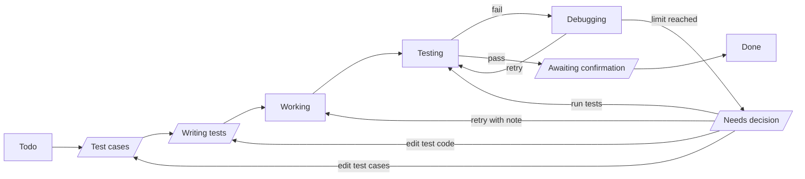
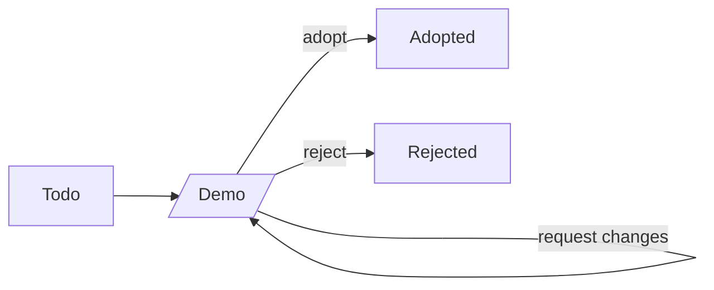
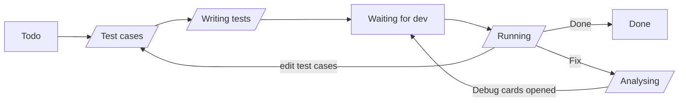

# Tickie: Product and Technical Decisions

Sep 26, 2026 · @Josh Tsai

## Overview

A fully local Mac desktop app for opening tickets and dispatching work to AI coding agents on my machine from a PM's (Project Manager's) point of view, with every card gated by locked test cases. The name is Tickie: a ticket is only done once every item on its acceptance checklist has been ticked.

**Goals**: stop getting lost halfway through my own side projects, and have a full-stack project I can talk about in job interviews in Sydney.

**Key difference**: existing tools put the diff at the center of review. This tool puts the **test cases** at the center; I only look at the code when I need to.

| Existing category | Examples | Has | Missing |
| --- | --- | --- | --- |
| AI agent kanban boards | [Vibe Kanban](https://github.com/BloopAI/vibe-kanban), Cline Kanban, AgentsRoom | Opening tickets, dispatching to local agents | Built around diffs and PRs; no schedule |
| Spec-driven development | [Kiro](https://kiro.dev/docs/specs/), GitHub Spec Kit | Phases, tasks, acceptance criteria | An IDE (Integrated Development Environment), not a visual PM interface |
| Local PM tools | [WayPoint](https://github.com/DonaldTrump-coder/WayPoint) | Local, kanban + Gantt chart | Doesn't dispatch work to coding agents |

Where this project sits = dispatching from the first category + acceptance gating from the second + a visual schedule from the third.

## Product rules

I finalize everything. Agents produce first drafts and do the work, and hand things back to me only when something goes wrong.

### Screens

1. The home page shows the five most recent projects. Each shows only its description and its current phase and task (the first unfinished card in planned order).
2. Opening a project shows all of its pending items, sorted by time. There is no priority ordering.
3. I **manage** one project at a time, but agents from several projects can **run** in the background at the same time.
4. A card that has an agent running on it shows a small animation or indicator light, so I can tell at a glance whether the agent is working or the card is waiting on me.

### Flow and roles

5. The planning agent discusses direction with me in chat → I approve → it produces a brief or agents.md. Planning work does **not** get cards.
   - The **IT supervisor agent** is for mid-project trouble: when a bug or a hard problem comes up, I talk it through with it in chat and it works out how to handle it (for example, a replacement card). It only **proposes**: nothing changes until I approve, just like planning. Like planning, this happens in chat and doesn't get cards. It also handles QA's Analysing step and can be called in from Needs decision.
6. Cards are units of work for agents. There are four card types: **Design**, **Build**, **Debug** and **QA** (Quality Assurance). I can open Design, Build and Debug cards myself; QA cards are never opened by hand (see below).
7. A Design card has the design agent build a demo; I decide whether to adopt it. Adopting it opens the Build cards that implement it, with the Design card as their prerequisite.
8. Test cases for Build, Debug and QA cards: AI writes a first draft in plain language → I review, add and remove → they're locked. A separate **test agent** then turns them into test code → I review → it's locked. The coding agent can read both but change neither; I can always change them.
9. When coding fails a set number of times in a row, it stops. The agent attaches its assessment without categorizing it; the final call is always mine.
10. When opening a card, list its prerequisite cards (there can be several). Until they're done or cancelled, the card can't start and its tests can't be written. Cards with no dependency between them can run in parallel.
11. QA E2E (End-to-End) tests run at the end of each phase, not once per card. Each phase has exactly **one** QA card, created by the planning agent as part of the plan.
12. Whether QA passes or fails, I make the call. Choosing Fix has the IT supervisor agent trace the problem and propose **Debug cards** (with draft test cases attached), which follow exactly the same flow as Build cards.

### Schedule

13. The planning agent estimates each card's planned start time and estimated hours, and I approve them together with the rest of the plan.
14. Estimated hours **include time spent waiting on me**, because that's a cost too.
15. The baseline is saved once at approval and never changes. Cards added later (including Debug cards) are marked "unplanned".

### Background execution

16. Closing the window leaves the agents running. Closing the laptop lid pauses them; when it's reopened they resume **automatically** from the latest git commit checkpoint and leave an entry on the card.

## Card status flows

Status names describe the **stage** a card is in, not whose turn it is. Some stages start with an agent working and end with the card waiting on me (slanted boxes below).

**Whose turn it is is derived, not stored**: if no agent is running on the card and it's not in a status that waits on other cards (Todo, Waiting for dev) or a finished status (Done, Cancelled, Adopted, Rejected), it's waiting on me. The "pending list" is simply every card in that situation.

Resuming automatically after a disconnect is **not** a status; it only leaves an entry in the status history.

### Build and Debug cards

- **Test cases**: AI drafts the plain-language test cases, then I review and lock them.
- **Writing tests**: the test agent writes the test code, then I review and lock it.
- **Debugging**: the coding agent retries and fixes things on its own without bothering me.
- **Needs decision**: it failed up to the limit in a row; the agent attaches its assessment and stops. I choose one of:
  - **Edit test cases** → Test cases: the acceptance criteria themselves are wrong.
  - **Edit test code** → Writing tests: the criteria are fine, but the test agent translated them into code wrongly.
  - **Retry with note** → Working: the agent is stuck going the wrong way; I tell it what to try.
  - **Run tests** → Testing: I fixed the code myself. If the tests still fail, the normal flow continues into Debugging, and the agent may change the code I edited (it still can't touch the tests).
  - **Ask IT supervisor**: talk it through in chat; it proposes one of the choices above (or new cards), and nothing happens until I approve.
  - **Cancel card** (see below).
- The consecutive-failure count **resets to zero** after any of these decisions.
- **Cancelled**: I can cancel a Build or Debug card at any point before it's Done. Any agent running on it stops immediately. Cancelled is an end state, and it **counts as finished** for dependencies and for QA's Waiting for dev: cards that depended on it simply go ahead. If one of them then fails because the cancelled work is missing, I (or the IT supervisor agent) open a new card to replace it.
- Design cards can't be cancelled (Rejected covers that), and neither can QA cards (a phase can't end without its one QA card).

### Design cards

- **Demo**: the design agent builds the demo, then I choose adopt, reject or request changes.
- Adopted and Rejected are separate end states, because a rejected design is still a meaningful outcome when looking back at the schedule.

### QA cards

- **Todo → Test cases** happens automatically when the phase starts, so the E2E test cases are written and reviewed while Build cards are still in progress.
- **Waiting for dev**: once the tests are locked, the QA card waits here as long as any other card in the phase (Design, Build or Debug) hasn't finished. Cancelled, Adopted and Rejected count as finished. When the last one finishes, the QA card moves to Running automatically.
- **Running**: the QA agent runs the E2E tests. Whether they all pass or not, it stops and I choose:
  - All passed: **Done** (the phase ends and the next phase begins) or **edit test cases**.
  - Something failed: **Fix** or **edit test cases**.
  - I can also choose Fix when everything passed, e.g. when I found a problem by hand. Fix takes an optional note describing what I saw.
- **Analysing**: the IT supervisor agent traces the problem and proposes Debug cards. Once I approve them they're opened, which sends the QA card back to Waiting for dev. If it finds no cause and proposes **no** cards, it stops and shows me its analysis instead of rerunning the same failing tests.
- Because every loop goes through me, QA can't retry forever on its own and needs no failure limit.
- The original cards' records stay unchanged.

## Data model

Layer by layer: Project → Phase → Card → Test case / Status history, each one-to-many. Prerequisites between cards are many-to-many and get their own dependency table. Principle: **anything that can be derived from system behavior is never entered by hand and never stored separately.**

### Project

| Field | Source |
| --- | --- |
| Name, description | Entered by me |
| Baseline frozen at | Recorded automatically when the plan is approved |
| Current phase and task | Not stored; derived from card statuses and order |

### Phase

| Field | Source |
| --- | --- |
| Name, order | Planned by the planning agent, approved by me |
| Is done | Not stored; true when the phase's QA card is Done |

### Card (Task)

| Field | Source |
| --- | --- |
| Title, tagline | Planning agent or me |
| Assigned agent | Set when the card is opened |
| Phase, order | Planned by the planning agent, approved by me |
| Planned start, estimated hours | Estimated by the planning agent, approved by me (including time waiting on me) |
| Current status | Updated by the system as the flow progresses |
| Is unplanned | Set automatically on cards added after approval |
| Card type | Design, Build, Debug or QA |
| Source card | Debug cards only; points to the card where the problem was found |
| Progress | Not stored; derived from passing tests (e.g. 3/5) |
| Actual start, actual end | Not stored; taken from the status history (first move out of Todo, and reaching an end state) |
| Agent running | Not stored; reported live by the background manager |
| Waiting on me | Not stored; derived from status and whether an agent is running (see "Card status flows") |

### Test case

| Field | Source |
| --- | --- |
| Card, content | First draft by AI, reviewed by me |
| Is locked | Locked when I finalize it |
| Passed on last run | Updated by the system when tests run |

### Status history

One entry per status change: card, from status, to status, time. Interruptions and resumes are recorded here too. Used to derive actual time, and later to feed back to the planning agent to calibrate its estimates.

### Agent runs

One entry each time an agent starts or stops working on a card: card, agent, start time, end time. Because status names no longer say whose turn it is, this is what lets the system derive total time spent waiting on me.

### Card dependency table

One row per relationship: card ← prerequisite card. The system checks this when a card is opened and doesn't allow circular dependencies (A waits on B, B waits on A).

## Tech stack and architecture

The UI and the background manager are two separate programs that talk through a local API (Application Programming Interface). Closing the window leaves the manager and the agents running.

| Layer | Choice | Why |
| --- | --- | --- |
| Desktop shell | Tauri (Mac build only for now) | Uses less memory than Electron; can bundle the C# manager as a sidecar; a Windows build is possible later |
| UI | Vue 3 | I want to practice it; common at Taiwanese companies; also in demand at .NET agencies in Sydney |
| Background manager | C# + ASP.NET Core (Controllers) | Builds on my C# from UTS courses; lots of .NET jobs in Sydney; one framework for both the API and background services |
| Data access | EF Core (Entity Framework Core, an ORM) | Can switch databases; also a common skill in .NET job listings |
| Database | SQLite | A single file built into the manager; no separate server |
| Real-time updates | SignalR | Pushes card changes; reconnects automatically when the laptop wakes up |
| Project output | Project folder + git | The brief, agents.md, tests and code are versioned in git; commits serve as resume checkpoints |

**Distribution**: using it myself costs nothing. Distributing it to others requires Apple signing and notarization through the Apple Developer Program (AUD $149/year); the free alternative is having users build from source. Homebrew stopped supporting unsigned apps on 2026-09-01, so that route isn't viable.

## Open questions and next steps

### Decided

- The whole system uses English: UI text, code, database values and documentation.
- Planning, design and QA roles: planning happens in chat with no cards; design and QA get their own card types and flows (see "Card status flows").

### Still open

- Whether "Needs decision" and the other status names above are final.
- The Debug card type and the Debugging status share a name ("a Debug card in Debugging"); one of them should be renamed.
- Whether a card should be called Card or Task in code (`Task` clashes with C#'s built-in `System.Threading.Tasks.Task`).
- Who drafts the Build cards when a Design card is adopted (the planning agent, the design agent, or me).
- Whether new Build or Debug cards can be opened in a phase whose QA is already Done, or only in the current phase.
- The limit on consecutive failures.
- What I can do with a card stuck in Needs decision (edit tests, send it back to Working, cancel the card?).
- Whether to show a macOS notification when a card enters a status that waits on me.
- Details of the Gantt chart view.

### Next steps

- [ ] Build a demo with Vue 3 and mock data, starting with the home page and the project page. The mock data follows the "Data model" section and will later become the API response format.
- [ ] The demo is finished when a card can be clicked through its whole flow from Todo to Done. Stop there instead of polishing the screens.
- [ ] Start writing the C# manager by hand, step by step, and connect it to real agents.
